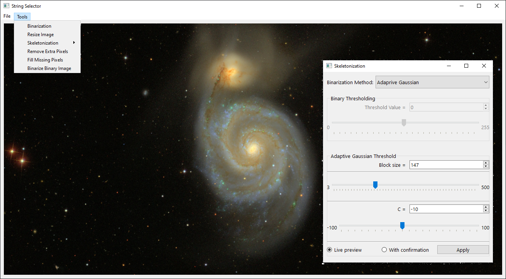
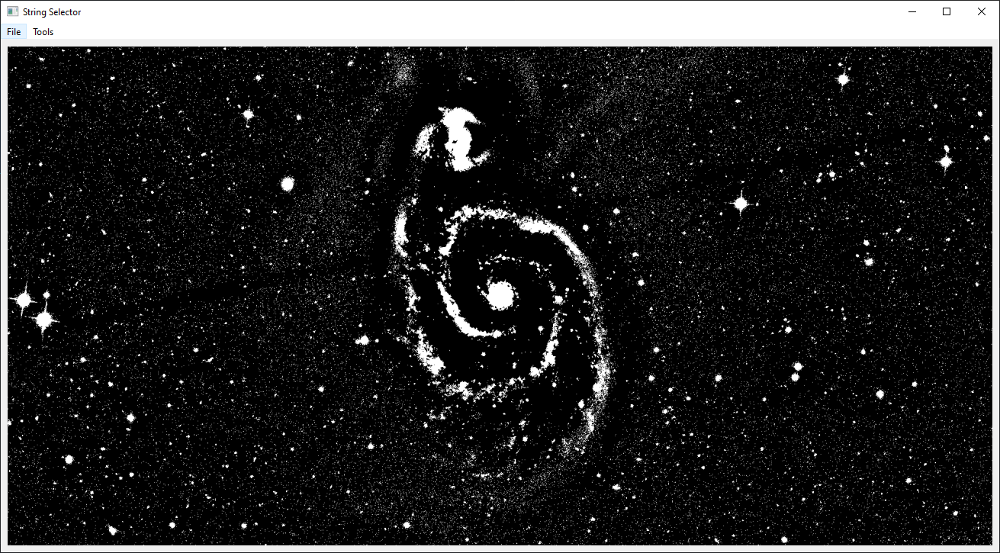
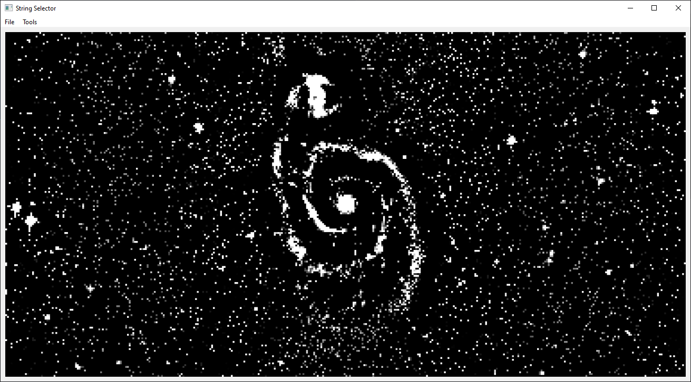
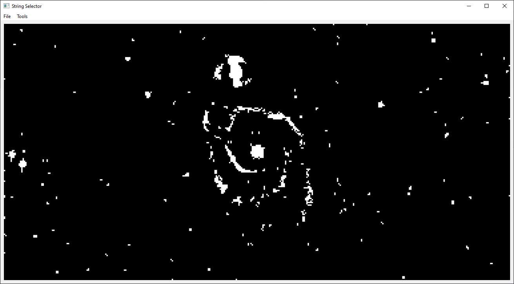
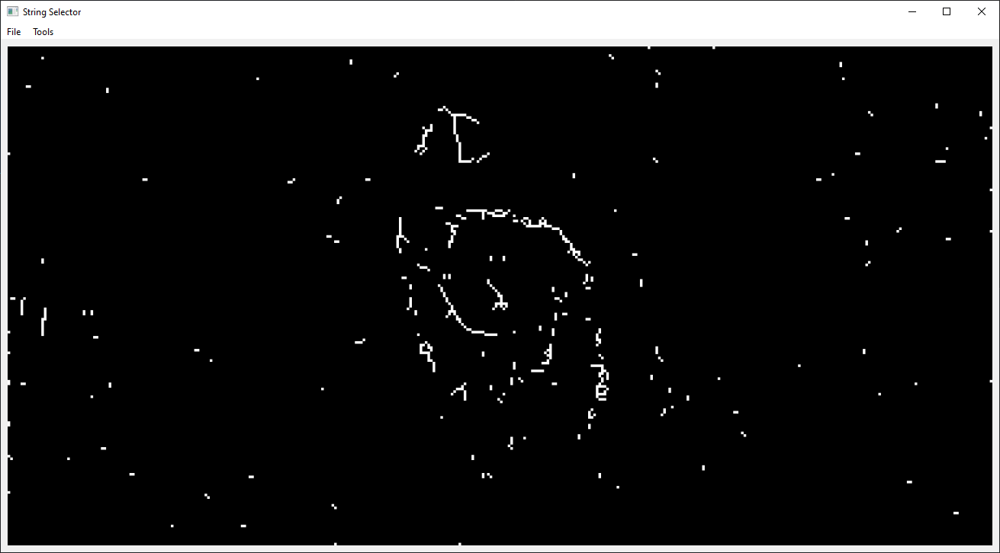

# A programm for highlighting string of spiral galaxies

# Processing stages

1. Binarization. Available to choose from:
   - Adaptive Gaussian.
   - Otsu Threshold.
   - Binary.
   

3. Resizing.
   

5. Noise removal.
   

7. Skeletoniztion. The Zong-sun method is used.
   

